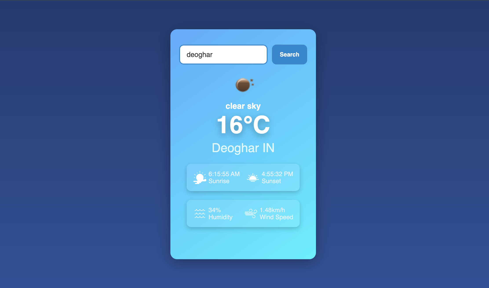

# ☁️ Weather App 🌞

## ✨ Overview
The **Weather App** is a simple, responsive, and intuitive web-based application that provides users with real-time weather updates for any location across the globe. With real-time temperature, weather conditions, humidity, wind speed, sunrise/sunset timings, and more, this app offers a comprehensive weather information experience.

Designed with modern web technologies and user experience best practices, this app brings you accurate weather details with a sleek and intuitive interface.

---
**GO LIVE** https://weather-app-khaki-ten.vercel.app/

## 🚀 Features
✅ **Real-Time Weather Information**  
   Fetch live weather data for any city or location worldwide.
✅ **Search by City Name**  
   Enter any city name to instantly view weather information.
✅ **View Multiple Weather Data Points**  
   Including temperature, humidity, wind speed, sunrise/sunset times, and more.
✅ **Dynamic & Responsive UI**  
   Fully responsive design optimized for desktop and mobile.
✅ **User-Friendly Search Options**  
   Input a city and get weather results with animated transitions.
✅ **Weather Condition Graphics**  
   Visual icons for weather conditions like clear skies, clouds, rain, and snow.
✅ **Sunrise & Sunset Timings**  
   Easily view the local sunrise and sunset information for the searched location.
✅ **Interactive Elements**  
   Experience smooth interactions with beautiful animations.
✅ **Lightweight & Fast Performance**  
   Fast load time and optimized performance.

---

## 📊 Tech Stack
The **Weather App** uses:

- **HTML5** - Markup language for structure.
- **CSS3 (Tailwind CSS)** - For sleek and responsive designs.
- **JavaScript (Vanilla JS)** - Fetch weather data, handle dynamic rendering.
- **Weather API Integration** - OpenWeatherMap or similar APIs for real-time weather data.

---

## 📖 How to Use
Follow these easy steps:

1. Open the **Weather App** in your browser.
2. Enter a city name in the **search bar** at the top.
3. Click the **Search button** to get real-time weather updates.
4. View weather stats including:
   - **Temperature** in Celsius/Fahrenheit.
   - **Wind speed**, **humidity**, and **sunrise/sunset timings**.
   - Visual indicators (clouds, rain, sun) for ease of understanding.
5. Explore related data by switching cities!

---

## 📸 Screenshots

### **1. Home Page - Initial State**
  

> *The intuitive home page with a search bar and navigation elements.*

---

### **2. Weather Dashboard - Results Page**
  

> *Detailed weather information for a searched location with dynamic graphics.*

---